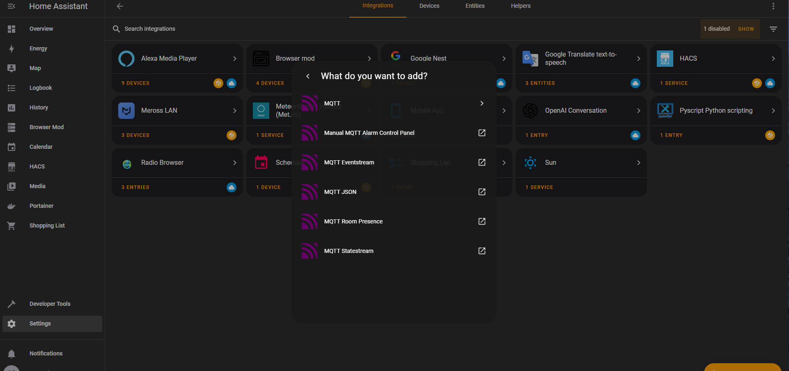

# Roomba-MQTT

<p align="center">
  
</p>

## Introduction

The Roomba-MQTT integration is a project that allows you to add Wi-Fi connectivity to non-WiFi models, such as the Roomba 860 vacuum cleaner, and control it through MQTT. With this integration, you can automate and monitor your Roomba using popular home automation platforms like Home Assistant.

## Features

- **Wi-Fi Connectivity:** Enables your Roomba 860 to connect to your local Wi-Fi network.
- **MQTT Control:** Control your Roomba via MQTT messages.
- **Home Assistant Integration:** Seamlessly integrate your Roomba with Home Assistant.

## Prerequisites

Before you get started, make sure you have the following:

## Hardware Used

- A Roomba 860 vacuum cleaner (or other non-WiFi model).
- An ESP-8266 microcontroller.
- Buck Converter
- PNP Transistor (e.g. 2N3906)
- Wires
- (Optional) 7 Pin mini DIN adapter to fit the Roomba SCI port

## Software Capabilities

Feel free to customize based on your needs. Currently, what's implemented is:

#### Startup Behavior

The following is the setup the ESP-8266 goes through when powered.

1. Wakes up the Roomba
2. Sets the baud rate/enables serial communication with the Roomba
3. Connects to WiFi and the MQTT server
4. Initializes/writes the starting music
5. Initializes the Roomba Data Read timer and the Keep Awake timer
6. Updates roomba/status topic
7. Plays the startup song - Useful for verbal feedback of a successful setup

#### MQTT Commands

These commands are what are publishable to the MQTT server roomba/commands topic
| **Command Name** | **MQTT Command** | **Default Behavior** |
|------------------|------------------|---------------------------------------------------------------------------|
| Start | `start` | Signals the roomba to begin cleaning |
| Stop | `stop` | Signals the roomba to return to the docking station |
| Halt | `halt` | Turns the **roomba** off and on to force the roomba to stop in place |
| Restart | `restart` | Restarts the **ESP-8266** |
| Max Clean | `max_clean` | Cleans for the maximum time |
| Spot Clean | `spot_clean` | Focuses on cleaning the current spot |
| Play Song 1 | `play_song1` | Plays the 5-note McDonald's Jingle |
| Play Song 2 | `play_song2` | Plays the Among Us song |
| Play Song 3 | `play_song3` | Plays 'A Cruel Angel's Thesis' song |

#### MQTT Topics

| **Topic**         | **Publishes/Subscribes** | **Purpose**                                                                | **Possible Values**                                                                                                         |
| ----------------- | ------------------------ | -------------------------------------------------------------------------- | --------------------------------------------------------------------------------------------------------------------------- |
| `roomba/status`   | Publishes                | Current status of the roomba                                               | - Cleaning<br> - Max Cleaning<br> - Spot Cleaning<br> - Returning<br> - Docked<br> - Halted<br> - Playing <name_of_song>    |
| `roomba/commands` | Subscribes               | Used for issuing commands to the roomba                                    | See MQTT Commands                                                                                                           |
| `checkIn/roomba`  | Publishes                | Signifies where an established connection is from a reboot or reconnection | - Reconnected<br> - Rebooted                                                                                                |
| `roomba/battery`  | Publishes                | Battery charge %                                                           | 0-100 integer                                                                                                               |
| `roomba/charging` | Publishes                | Status code for charging                                                   | - 0 Not Charging<br> - 1 Charging Recovery<br> - 2 Charging<br> - 3 Trickle Charging<br> - 4 Waiting<br> - 5 Charging Error |

## Installation

### Wiring Diagram

1. Diagram image

<p align="center">
  
</p>

### Software Setup

- A compatible MQTT broker (e.g., MQTT Explorer).
- Arduino IDE
  - Including the following libraries: PubSubClient, SimpleTimer, and Roomba. Zip archives can also be found [here](ThirdParty/)
  - Source links:
    - [Roomba](http://airspayce.com/mikem/arduino/Roomba/)
    - [PubSubClient](https://github.com/knolleary/pubsubclient)
    - [SimpleTimer](https://playground.arduino.cc/Code/SimpleTimer/)
- Home Assistant installed and configured.
  - Link to my custom HA setup and its use of the Roomba-MQTT project can be found [here (TODO)](TODO)
- Flash Roomba_MQTT.ino onto the ESP8266 (with credentials updated)

### Portainer Setup - MQTT Server

Alternatively, you can skip this steps 1-7 of section if following the below section: **Docker Compose Setup - MQTT Server**.

1. Create 3 Volumes `mqtt_config`, `mqtt_data`, `mqtt_log`
<p align="center">
  
</p>

2. Create container using the image `eclipse-mosquitto`
<p align="center">
  
</p>

3. Command & logging
<p align="center">
  
</p>

4. Setup container volumes
<p align="center">
  
</p>

5. Advanced container settings - Network
<p align="center">
  
</p>

6. Advanced container settings - Restart Policy
<p align="center">
  
</p>

7. Deploy the container
<p align="center">
  
</p>

8. Login to the container either through Portainer or CLI `docker exec -it mqtt /bin/bash`. Verify the mqtt server is operating on port `1883` by using `netstat -lntp | grep 1883`
<p align="center">
  
</p>

9. Setup the `mosquitto.conf` by first creating a backup. `cd mosquitto/config/` followed by `cp mosquitto.conf mosquitto.conf.orig`
<p align="center">
  
</p>

10. `vi mosquitto.conf` and modify to match the following
<p align="center">
  
</p>

11. Run `netstat -lntp | grep 1883` after saving to see if we are now properly listening outside the device on port 1883
<p align="center">
  
</p>

12. Setup the mosquitto password `mosquitto_passwd -c /mosquitto/config/credentials mqtt`. A new file called `credentials` will now exist.
<p align="center">
  
</p>

13. Modify `mosquitto.conf` again to include the credentials file.
<p align="center">
  
</p>

### Docker Compose Setup - MQTT Server

If already familiar with docker, here is an alternative way of setting up with `docker-compose.yaml`. I've trimmed out any services that are not directly relevant to the Roomba MQTT integration. In here, I bind 3 volumes to my host at `/opt/.mqtt/`. I expose port `1883` so that the Roomba and Home Assistant can communicate with it on the same physical network.

```
version: "3.8"

networks:
  home-assistant-network:
    driver: bridge
    ipam:
      driver: default
      config:
        - subnet: 172.16.1.0/24

services:

# ... Other services

  mqtt:
    container_name: mqtt
    image: eclipse-mosquitto:latest
    volumes:
      - /opt/.mqtt/config:/mosquitto/config
      - /opt/.mqtt/data:/mosquitto/data
      - /opt/.mqtt/log:/mosquitto/log
    restart: unless-stopped
    ports:
      - "1883:1883"
    networks:
      home-assistant-network:
        ipv4_address: 172.16.1.7
```

Return to step 8 in **Portainer Setup - MQTT Server** to set up the mosquitto config.

### MQTT Explorer Setup

1. Launch the application and setup the connection to `mqtt://<YOUR_MQTT_INTERNAL_IP>:1883` with your credentials
<p align="center">
  
</p>

2. Depending if you have configured the NodeMCU/ESP-8266 for the Roomba and/or Home Assistant, your feed will look something like:
<p align="center">
  
</p>

3. If you havn't already, configure the Roomba.

4. Once you have configured the Roomba, you will be able to publish commands to `roomba/commands`
<p align="center">
  
</p>
See MQTT Commands and MQTT Topics for more information on the displayed feeds and supported functionality.

5. (Optional) If you havn't already configure Home Assitant to use MQTT. Once it is connected, you can test it in the `Publish a packet` section of the Home Assistant MQTT configuration.

### Home Assistant Setup

The following was tested on Home Assistant 2022.10 in the container verison.

1. Add the MQTT Integration
<p align="center">
  
</p>
<p align="center">
  
</p>

2. Check the MQTT Configuration and make sure it is listening to the needed topics (e.g. `roomba/charging`, `roomba/battery`)
<p align="center">
  
</p>

3. Modify your `configuration.yaml` for Home Assistant to include all the supported Roomba commands by adding:

```
# Roomba Switch and Sensors
mqtt:
  - switch:
      - unique_id: roomba_switch_start_stop
        name: "Roomba"
        command_topic: "roomba/commands"
        payload_on: "start"
        payload_off: "stop"
        icon: mdi:robot-vacuum
  - sensor:
      - unique_id: roomba_sensor_status
        name: "Roomba Status"
        state_topic: "roomba/status"
      - unique_id: roomba_sensor_battery
        name: "Roomba Battery"
        state_topic: "roomba/battery"
        icon: mdi:battery
      - unique_id: roomba_sensor_charging_value
        name: "Roomba Charging Value"
        state_topic: "roomba/charging"
        icon: mdi:google-analytics
      - unique_id: roomba_sensor_commands_log
        name: "Roomba Commands Log"
        state_topic: "roomba/commands"
        icon: mdi:google-analytics
  - button:
      - unique_id: roomba_button_clean
        name: "Roomba Clean"
        command_topic: "roomba/commands"
        payload_press: "start"
        icon: mdi:arrow-right-drop-circle
      - unique_id: roomba_button_dock
        name: "Roomba Dock"
        command_topic: "roomba/commands"
        payload_press: "stop"
        icon: mdi:backburger
      - unique_id: roomba_button_max_clean
        name: "Roomba Max Clean"
        command_topic: "roomba/commands"
        payload_press: "max_clean"
      - unique_id: roomba_button_spot_clean
        name: "Roomba Spot Clean"
        command_topic: "roomba/commands"
        payload_press: "spot_clean"
      - unique_id: roomba_button_halt
        name: "Roomba Halt"
        command_topic: "roomba/commands"
        payload_press: "halt"
        icon: mdi:alert-octagon
      - unique_id: roomba_button_restart
        name: "Roomba Restart"
        command_topic: "roomba/commands"
        payload_press: "restart"
        icon: mdi:restart
      - unique_id: roomba_button_play_song1
        name: "Roomba Song 1"
        command_topic: "roomba/commands"
        payload_press: "play_song1"
        icon: mdi:music-note
      - unique_id: roomba_button_play_song2
        name: "Roomba Song 2"
        command_topic: "roomba/commands"
        payload_press: "play_song2"
        icon: mdi:music-note
      - unique_id: roomba_button_play_song3
        name: "Roomba Song 3"
        command_topic: "roomba/commands"
        payload_press: "play_song3"
        icon: mdi:music-note
      - unique_id: roomba_button_play_song4
        name: "Roomba Song 4"
        command_topic: "roomba/commands"
        payload_press: "play_song4"
        icon: mdi:music-note
```

4. View your Home Assistant entities on the web GUI to see them added. Example:
<p align="center">
  
</p>

## Examples

### Home Assistant

#### Automations

Run the roomba on a routine basis (e.g. Monday and Wednesday at 1045)
`automations.yaml`

```
- id: 'XXXXXXXXX' # Redacted
  alias: Time 1035 - MW - Roomba Cleaning Routine
  description: ''
  trigger:
  - platform: time
    at: '10:35:00'
  condition:
  - condition: time
    weekday:
    - mon
    - wed
  action:
  - service: switch.turn_on
    data: {}
    target:
      entity_id: switch.roomba
```

Ensure the Roomba starts returning after a certain time running (e.g. 75 minutes)
`automations.yaml`

```
- id: 'XXXXXXXXX' # Redacted
 alias: Roomba Stil On - Confirm Running 75+ minutes - Seek Dock
 trigger:
 - platform: state
   entity_id: switch.roomba
   to: 'on'
 action:
 - delay:
     hours: 1
     minutes: 15
 - condition: state
   entity_id: switch.roomba
   state: 'on'
 - service: switch.turn_off
   entity_id: switch.roomba
```

Change Roomba Status to "Docked" (see use case in `description`).
`automations.yaml`. Note that we add delays in the event that innacurate
charging values are reported. These inaccuracies can be seen in the breaks on
the below Home Assistant screenshot.

<p align="center">
  
</p>

```
- id: 'XXXXXXXXX' # Redacted
  alias: Roomba Status Docked - Ensure MQTT Reports Off
  description: 'When the Roomba automatically completes its cleaning cycle, status
    is Docked but last executed command is still "start." Update the switch and MQTT
    last command by executing a stop/turn off. It must only occur when status transitions
    from "Cleaning" to "Docked." Allowing any previous status (i.e. "Returning", "Playing
    Song") will cause a potential infinite loop and/or unnecessary calls since "turn_off"
    may cause a "Returning" status.

    UPDATE: A potential bug where the charging value is 0 while cleaning led to it
    seeking the dock. Times have been extended to ensure the 0 value is not a fluke.'
  trigger:
  - platform: state
    entity_id:
    - sensor.roomba_status
    to: Docked
    from: Cleaning
    for:
      hours: 0
      minutes: 0
      seconds: 10
  condition:
  - condition: state
    entity_id: switch.roomba
    state: 'on'
  - condition: not
    conditions:
    - condition: state
      entity_id: sensor.roomba_charging_value
      state: '0'
      for:
        hours: 0
        minutes: 0
        seconds: 5
  action:
  - delay:
      hours: 0
      minutes: 0
      seconds: 5
      milliseconds: 0
  - service: switch.turn_off
    entity_id: switch.roomba
```

Notify that a physical disconnection happened via Alexa and iOS (use case: Roomba ran into something that caused loose/broken physical connections).
`automations.yaml`

```
- id: 'XXXXXXXXX' # Redacted
  alias: Roomba Disconnected - Send Alerts
  description: When the Roomba battery changes to "NO DATA," this is an indication
    that we have lost signal to the Roomba.
  trigger:
  - platform: state
    entity_id:
    - sensor.roomba_battery
    to: NO DATA
  condition: []
  action:
  - service: switch.turn_off
    entity_id: switch.roomba
  - device_id: XXXXXXXXX # Redacted
    domain: mobile_app
    type: notify
    message: Roomba MQTT Disconnected
    title: Roomba No Signal
  - service: notify.alexa_media_living_room_show
    data:
      message: Roomba has lost signal. If this is not intentional, please turn the
        Roomba off manually.
  - delay:
      hours: 0
      minutes: 0
      seconds: 10
      milliseconds: 0
  - service: notify.alexa_media_living_room_show
    data:
      message: Roomba has lost signal. If this is not intentional, please turn the
        Roomba off manually.
  - delay:
      hours: 0
      minutes: 0
      seconds: 10
      milliseconds: 0
  - service: notify.alexa_media_living_room_show
    data:
      message: Roomba has lost signal. If this is not intentional, please turn the
        Roomba off manually.
  - delay:
      hours: 0
      minutes: 0
      seconds: 10
      milliseconds: 0
  mode: single
```

Roomba MQTT reconnected (after disconnecting).
`automations.yaml`

```
- id: 'XXXXXXXXX' # Redacted
  alias: Roomba Reconnected - Send Alert
  description: When the Roomba battery changes from "NO DATA," this is an indication
    that we are back online
  trigger:
  - platform: state
    entity_id:
    - sensor.roomba_battery
    to:
    from: NO DATA
  condition: []
  action:
  - service: switch.turn_off
    entity_id: switch.roomba
  - device_id: XXXXXXXXX # Redacted
    domain: mobile_app
    type: notify
    message: Roomba MQTT Connected
    title: Roomba Back Online
  mode: single
```

#### Scripts

Scripts can be useful to serve as a "shortcut" or have a Roomba entity/command emulate as a device. This is particularly useful if you want to setup an Alexa routine (i.e. "Alexa, turn on the Roomba). Because of Alexa's visibility, you would need to create a script
that controls an individual command to be executed on the Roomba. Once added, on the Web GUI, its important to verify that the voice assistant being used has access to the script.
`scripts.yaml`

```
roomba_off:
  alias: Turn Off Roomba
  sequence:
  - service: switch.turn_off
    data: {}
    target:
      entity_id: switch.roomba
  mode: single
  icon: mdi:robot-vacuum
roomba_on:
  alias: Turn On Roomba
  sequence:
  - service: switch.turn_on
    data: {}
    target:
      entity_id: switch.roomba
  mode: single
  icon: mdi:robot-vacuum
play_roomba_song_1:
  alias: Play Roomba Song 1
  sequence:
  - service: button.press
    data: {}
    target:
      entity_id: button.roomba_song_1
  mode: single
  icon: mdi:music
play_roomba_song_2:
  alias: Play Roomba Song 2
  sequence:
  - service: button.press
    data: {}
    target:
      entity_id: button.roomba_song_2
  mode: single
  icon: mdi:music
play_roomba_song_3:
  alias: Play Roomba Song 3
  sequence:
  - service: button.press
    data: {}
    target:
      entity_id: button.roomba_song_3
  mode: single
  icon: mdi:music
roomba_halt:
  alias: Roomba Halt
  sequence:
  - service: button.press
    data: {}
    target:
      entity_id: button.roomba_halt
  mode: single
  icon: mdi:stop-circle
```

### Screenshots

A tile widget on the lovelace dashboard that shows basic control and sensor data

<p align="center">
  
</p>

Breadboard setup on Roomba

<p align="center">
  
</p>

"Housing unit" for holding the parts together

<p align="center">
  
</p>

Semi-finalized layout on Roomba

<p align="center">
  
</p>

Possible TODO: Add video links to the Roomba in action and demonstrating its features.

## Lessons Learned

- Continue working on my soldering skills
- Parts were being frequently replaced/fixed due to the Roomba getting caught in objects or ramming a little to hard. (The goal was to adapt the Roomba to the environment rather than changing the environment i.e. moving furniture)
- Possibly fit the parts inside the Roomba. Others have done that but it didn't seem feasible with the particular model I worked on given the size of the PCB I assembled.
- To add to the sturdiness, I got a 7 pin mini DIN adapter. The first one, I was trying to solder to the header but had heat difficulty. To get the solder hot enough, the plastic of the header would get to hot and easily shift around. I ended up just getting an extender female-male splitter for $5. This allowed the Roomba SCI connection to be sturdy with the adapter bit sticking into it and running the other wires in a safer location.

## References

Video for learning about interfacing with the roomba: https://www.youtube.com/watch?v=juSoczXtlxA&list=LL&index=18 <br>
Video for learning about MQTT integration with Home Assistant: https://www.youtube.com/watch?v=juSoczXtlxA&list=LL&index=18 <br>
Consult the [Roomba_SCI_manual](Roomba_SCI_manual.pdf) to learn more about serial communication with Roomba devices. <br>

---

License
This project is licensed under the MIT License.
